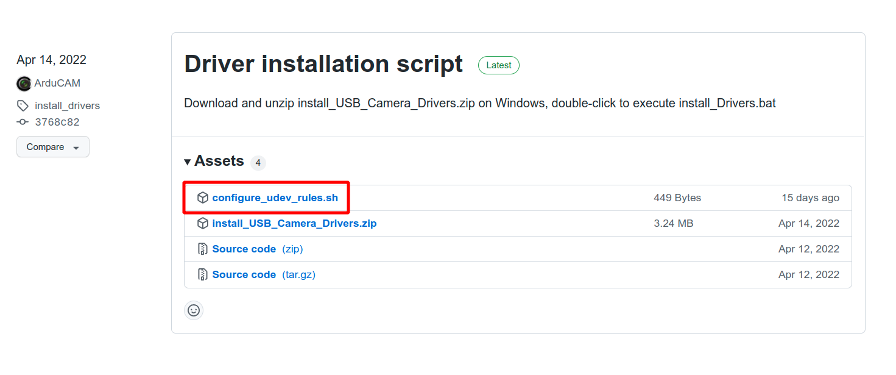

# Introduction

This is the new SDK for Arducam EVK, currently in beta version and only supports Linux.

## Installation dependence

1. opencv
2. arducam-evk-sdk-beta-dev
3. arducam-config-parser-dev

```
sudo apt install libopencv-dev

curl -s --compressed "https://arducam.github.io/arducam_ppa/KEY.gpg" | sudo apt-key add -
sudo curl -s --compressed -o /etc/apt/sources.list.d/arducam_list_files.list "https://arducam.github.io/arducam_ppa/arducam_list_files.list"
sudo apt update
sudo apt install arducam-config-parser-dev arducam-evk-sdk-beta-dev
```

### set udev rules

[Download script](https://github.com/ArduCAM/ArduCAM_USB_Camera_Shield/releases/download/install_drivers/configure_udev_rules.sh)



execute script

```
sudo chmod +x configure_udev_rules.sh
./configure_udev_rules.sh
```
