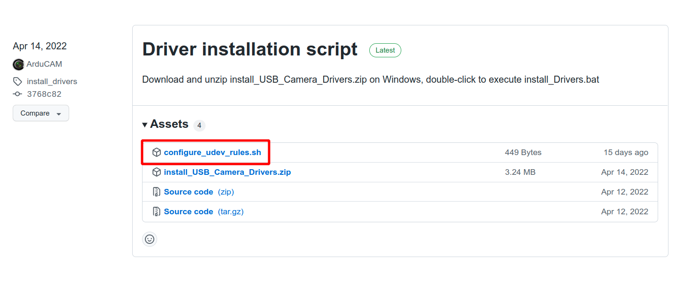

### Note: For Windows, please refer to [Windows Environmental Installation](./windows_environmental_install.md)
# Linux

## Installation dependence

1. opencv
2. arducam-evk-sdk-dev
3. arducam-config-parser-dev

```
sudo apt install libopencv-dev cmake

curl -s --compressed "https://arducam.github.io/arducam_ppa/KEY.gpg" | sudo apt-key add -
sudo curl -s --compressed -o /etc/apt/sources.list.d/arducam_list_files.list "https://arducam.github.io/arducam_ppa/arducam_list_files.list"
sudo apt update
sudo apt install arducam-config-parser-dev arducam-evk-sdk-dev
```

### set udev rules

[Download script](https://github.com/ArduCAM/ArduCAM_USB_Camera_Shield/releases/download/install_drivers/configure_udev_rules.sh)



execute script

```
sudo chmod +x configure_udev_rules.sh
./configure_udev_rules.sh
```

## Quick Start
To run the demo in the fastest and simplest way, it is recommended to use the [Python demo](../python/README.md#run-sync-demo) (please install the [driver](#installation-dependence) and [Python dependencies](../python/README.md#installation-dependence) before trying it).