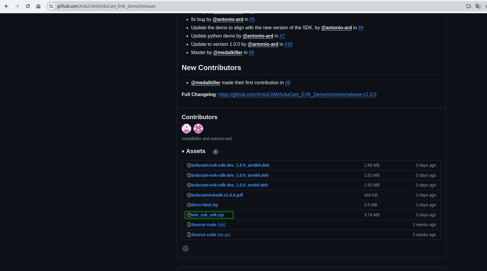

# [Linux Environmental Installation](./linux_environmental_install.md)

## Windows

### Install Driver

[Dowload Driver](https://github.com/ArduCAM/ArduCAM_USB_Camera_Shield/releases/download/install_drivers/install_USB_Camera_Drivers.zip)

Unzip the package after the download is complete.

Double-click to execute the install_driver.bat file.

### Install cmake

Please operate according to the corresponding package on the official website

[cmake Download link](https://cmake.org/download/)

### Install Visual Studio environment

Install `Build Tools for Visual Studio` or `Visual Studio`  
<https://visualstudio.microsoft.com/downloads/>

### Install evk sdk

Download win_evk_sdk.zip
<https://github.com/ArduCAM/ArduCam_EVK_Demo/releases>

After downloading, please unzip it to the desktop. If you unzip it in another directory, please remember the directory location as you will need it later.  

(1). Open `Advanced System Settings`  

  
(2). Setting up compiler environment `arducam_evk_cpp_sdk_DIR`  

  
(3). Setting up compiler environment `arducam_evk_sdk_DIR`  

  

### Install Opencv

1. download and install ([opencv Releases](https://opencv.org/releases/))

2. add environment variable

`Note`: all the environment directories shown below are examples. Please fill in the actual storage directory for actual operation.

(1). Open `Advanced System Settings`  

  
(2). Setting up compiler environment `OpenCV_DIR`  

  
(3). Set up the opencv executable file environment  

  
